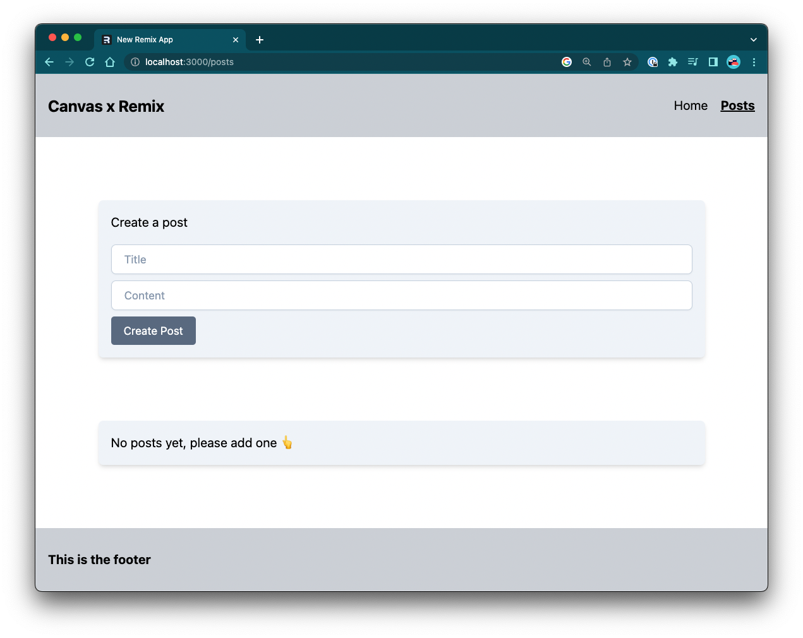

# Remix Canvas template

Canvas studio remix template, use this template to kickstart your next Remix website app. We've some libraries and
configuration to suit Canvas standards. Check out the [Demo Instructions](docs/DEMO_INSTRUCTIONS.md).

## Usage

- Click the "Use this template" button at the top-right.
- Select "Create new repository" from the list.

## Links

- [Remix README](docs/REMIX-README.md)
- [Remix Docs](https://remix.run/)
- [Tailwind Docs](https://tailwindcss.com/docs/installation)

## What's in the box?

- Prisma: ORM / SQLite
- Tailwind: CSS utility classes.
- ESLint: Code Quality.
- Prettier: Code formatting.

